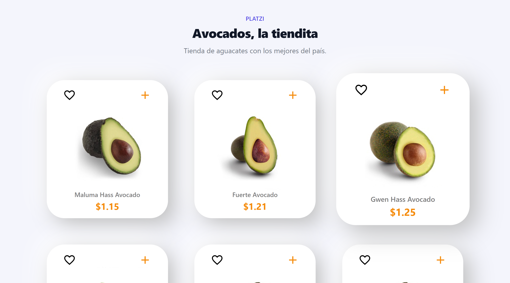

# Avocado Market

## About the project

This project was built to put into practice the basics about DOM manipulation in JavaScript.  
Template: https://github.com/jonalvarezz/snowpack-template-tailwind
API: https://platzi-avo.vercel.app/api/avo

Live: https://rodedd.github.io/avocado-market/

### Built with

- HTML
  - Semantic HTML
- CSS
  - Grid
  - Flexbox
- JavaScript
  - Vanilla JS
  - DOM Manipulation
  - Fetch API
  - Async / Await
